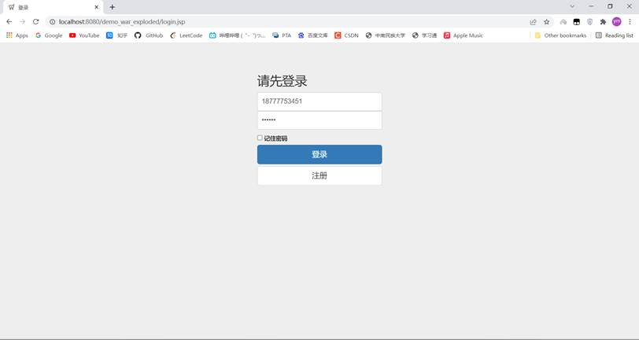
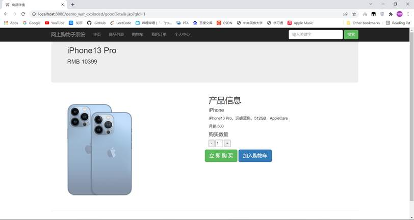
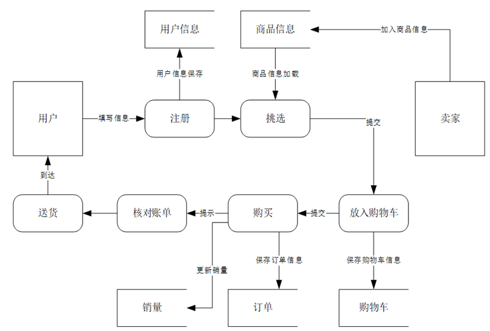
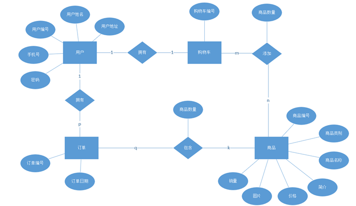
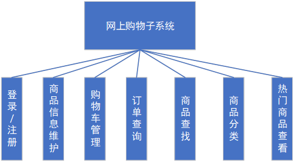
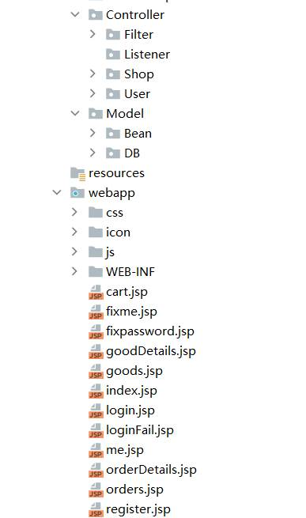

# README

#### 网上购物子系统界面

- 登陆界面：

- 首页

- 商品详情页

#### 网上购物子系统数据流图

#### 购物子系统的整体E-R图

系统E-R图各实体的属性如下：
 （1） 用户：用户姓名，用户地址，用户编号，手机号，密码。
 （2） 购物车：购物车编号。
 （3） 订单：订单编号，订单日期。
 （4） 商品：商品编号，商品类别，商品名称，简介，价格，图片，销量。

#### E-R图向关系模式转换

由于概念设计的结果是ER图，DBMS一般采用关系模型，因此数据库的逻辑设计过程就是把ER图转化为关系模式的过程将该系统的总体概念结构E-R图转换为关系模型:

1. 用户（用户编号，用户姓名，用户地址，用户编号，手机号，密码）
2. 商品（商品编号，商品类别，商品名称，简介，价格，图片，销量）
3. 购物车（购物车编号，用户编号，商品编号，商品数量）
4. 订单（订单编号，用户编号，商品编号，商品数量，订单日期）
5. 销售关系 （商品编号，会员编号，交易量，交易日期）

 

1User表

| 序号 | 字段名    | 数据类型     | 是否为主键 | 是否允许为空 | 默认值 | 功能描述 |      |
| :--: | --------- | ------------ | ---------- | ------------ | ------ | -------- | ---- |
|  1   | userId    | int          | PRI        | 否           | 无     | 用户编号 |      |
|  2   | uName     | varchar(100) |            | 否           | 无     | 用户姓名 |      |
|  3   | uAddress  | varchar(200) |            | 否           | 无     | 用户地址 |      |
|  4   | uNumber   | varchar(200) |            | 否           | 无     | 手机号   |      |
|  5   | uPassword | varchar(200) |            | 否           | 无     | 密码     |      |

 

2 Goods表

| 序号 | 字段名    | 数据类型     | 是否为主键 | 是否允许为空 | 默认值 | 功能描述 |      |
| :--: | --------- | ------------ | ---------- | ------------ | ------ | -------- | ---- |
|  1   | goodsId   | int          | PRI        | 否           | 无     | 商品编号 |      |
|  2   | gName     | varchar(100) |            | 否           | 无     | 商品名称 |      |
|  3   | gDetail   | varchar(500) |            | 否           | 无     | 商品简介 |      |
|  4   | gPrice    | int          |            | 否           | 无     | 价格     |      |
|  5   | gPicture  | varchar(255) |            | 否           | 无     | 图片     |      |
|  6   | gCategory | varchar(20)  |            | 否           | 无     | 商品类别 |      |
|  7   | gSales    | int          |            | 是           | 0      | 销量     |      |
|      |           |              |            |              |        |          |      |

 

3 ShoppingCart表

| 序号 | 字段名 | 数据类型 | 是否为主键 | 是否允许为空 | 默认值 | 功能描述   |      |
| :--: | ------ | -------- | ---------- | ------------ | ------ | ---------- | ---- |
|  1   | sId    | int      | PRI        | 否           | 无     | 购物车编号 |      |
|  2   | uId    | int      | FK         | 否           | 无     | 用户编号   |      |
|  3   | gId    | int      | FK         | 否           | 无     | 商品编号   |      |
|  4   | gNum   | int      |            | 否           | 1      | 商品数量   |      |
|      |        |          |            |              |        |            |      |

 

4 Order表

| 序号 | 字段名 | 数据类型 | 是否为主键 | 是否允许为空 | 默认值 | 功能描述 |      |
| :--: | ------ | -------- | ---------- | ------------ | ------ | -------- | ---- |
|  1   | oId    | int      | PRI        | 否           | 无     | 订单编号 |      |
|  2   | uId    | int      | FK         | 否           | 无     | 用户编号 |      |
|  3   | gId    | int      | FK         | 否           | 无     | 商品编号 |      |
|  4   | gNum   | int      |            | 否           | 无     | 商品数量 |      |
|  5   | oTime  | time     |            | 否           | 无     | 订单日期 |      |
|      |        |          |            |              |        |          |      |

####  

#### 子模块划分及功能概述

1. 会员管理：用户申请成为会员，记录会员的详细资料（包括会员编号，会员姓名，会员地址），方便货物的邮寄。

2. 商品信息管理：维护商品信息（包括商品编号、商品名称、价格、简介、图片等信息）。会员可以查看商品信息。

3. 购物车管理：用户可以将商品放入自己的购物车（包括购物车编号、商品编号，商品数量等），可以在购物车中添加或删除。

4. 订单查询：会员可以查找自己的所有订单信息（包括订单编号、会员编号、订单日期等）。

5. 商品查找：选择商品分类并输入要查询的商品名称可以查询商品的详细信息。

6. 商品分类：对商品分类（包括分类编号、分类名称等），使用户可以在某商品列表中查看该类所有的商品。

#### 应用程序设计

系统采用Servlet、JSP、JDBC、Filter等JavaEE技术，采用MVC——Model-View-Controller（模型-视图-控制器）的设计模式。

1. Model（模型），使用JDBC技术进行数据库的读取，和运用JavaBean对数据进行存储。

2. View（视图），使用JSP来实现页面的显示，数据的可视化。

3. Controller（控制器），使用Servlet和Filter等技术实现数据的处理和加工，作用于模型和视图上。它控制数据流向模型对象，并在数据变化时更新视图。它使视图与模型分离开。

